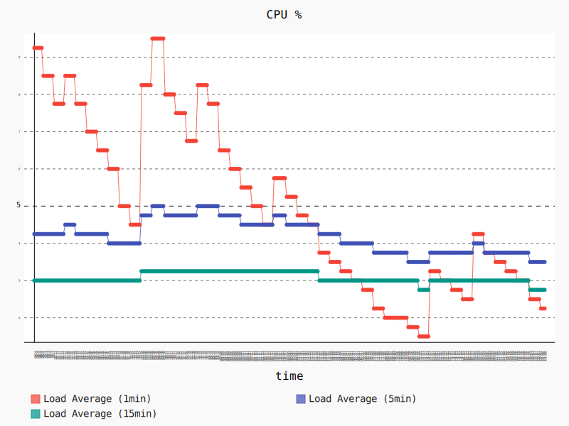
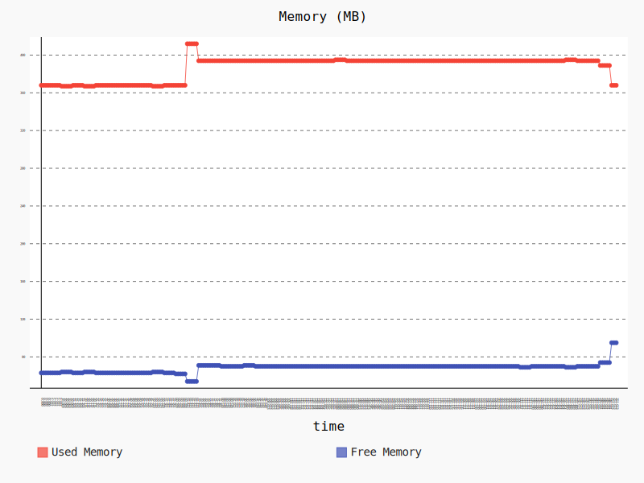

# cloudwatch_logger

## Overview
The **`cloudwatch_logger`** node enables logs generated in a ROS system to get sent to AWS CloudWatch Logs. Out of the box, this node provides the ability to subscribe to the **`/rosout_agg`**  (rosout aggregated) topic, which all logs using the ROS logging framework will be published to, and sends logs to the AWS CloudWatch Logs service. Logs can be sent to AWS CloudWatch Logs selectively based on log severity. The **`cloudwatch_logger`** node can also subscribe to other topics if logs are not sent to **`/rosout_agg`**, and it is able to unsubscribe to the rosout_agg topic for getting logs.

The **`cloudwatch_logger`** node wraps the [aws-sdk-c++] in a ROS service API.

**Amazon CloudWatch Logs Summary**: AWS CloudWatch Logs can monitor applications and systems using log data. You can create alarms in CloudWatch and receive notifications of particular API activity as captured by CloudTrail and use the notification to perform troubleshooting. By default, logs are kept indefinitely and never expire. You can adjust the retention policy for each log group, keeping the indefinite retention, or choosing a retention periods between 10 years and one day. AWS CloudWatch Logs stores your log data in highly durable storage.

**Features in Active Development**:
- Offline caching: now, a batch of logs will be dropped if the node fails to send them to AWS CloudWatch Logs. We will enable offline caching and try to save logs.
- Send logs to different log groups/streams: now, one node will send logs to one log stream within one log group. We will enable a node to send logs to different log groups/streams.

**Keywords**: ROS Application logs, System logs, AWS CloudWatch Logs service

### License
The source code is released under an [Apache 2.0].

**Author**: AWS RoboMaker 
**Affiliation**: [Amazon Web Services (AWS)] 
**Maintainer**: AWS RoboMaker, ros-contributions@amazon.com

### Supported ROS Distributions
- Kinetic
- Melodic

### Build status

* Travis CI: 
 * ROS build farm:
   * v1.0.0:
     * ROS Kinetic @ u16.04 Xenial 

## Installation

### AWS Credentials
You will need to create an AWS Account and configure the credentials to be able to communicate with AWS services. You may find [AWS Configuration and Credential Files] helpful.

This node will require the following AWS account IAM role permissions:
- `logs:PutLogEvents`
- `logs:DescribeLogStreams`
- `logs:CreateLogStream`
- `logs:CreateLogGroup`

### Binaries
On Ubuntu you can install the latest version of this package using the following command

        sudo apt-get update
        sudo apt-get install -y ros-kinetic-cloudwatch-logger

### Building from Source

To build from source you'll need to create a new workspace, clone and checkout the latest release branch of this repository, install all the dependencies, and compile. If you need the latest development features you can clone from the `master` branch instead of the latest release branch. While we guarantee the release branches are stable, __the `master` should be considered to have an unstable build__ due to ongoing development. 

- Create a ROS workspace and a source directory

    mkdir -p ~/ros-workspace/src

- Clone the package into the source directory . 

_Note: Replace __`{MAJOR.VERSION}`__ below with the latest major version number to get the latest release branch._

        cd ~/ros-workspace/src
        git clone https://github.com/aws-robotics/cloudwatchlogs-ros1.git -b release-v{MAJOR.VERSION}

- Install dependencies

        cd ~/ros-workspace 
        sudo apt-get update && rosdep update
        rosdep install --from-paths src --ignore-src -r -y
        
_Note: If building the master branch instead of a release branch you may need to also checkout and build the master branches of the packages this package depends on._

- Build the packages

        cd ~/ros-workspace && colcon build

- Configure ROS library Path

        source ~/ros-workspace/install/setup.bash

- Build and run the unit tests

        colcon test --packages-select cloudwatch_logs_common && colcon test-result --all

## Launch Files
An example launch file called `sample_application.launch` is provided.

## Usage

### Run the node
- **With** launch file using parameters in .yaml format (example provided)
  - ROS: `roslaunch cloudwatch_logger sample_application.launch`

- **Without** launch file using default values
  - ROS: `rosrun cloudwatch_logger cloudwatch_logger`

### Send a test log message
- `rostopic pub -1 /rosout rosgraph_msgs/Log '{header: auto, level: 2, name: test_log, msg: test_cloudwatch_logger, function: test_logs, line: 1}'`

### Verify that the test log message was successfully sent to CloudWatch Logs
- Go to your AWS account
- Find CloudWatch and click into CloudWatch
- On the upper right corner, change region to `Oregon` if you launched the node using the launch file, or change to `N. Virginia` if you launched the node without using the launch file
- Select `Logs` from the left-hand side menu
- **With** launch file: The name of the log group should be `robot_application_name` and the log stream should be `device name`
- **Without** launch file: The name of the log group should be `ros_log_group` and the log stream should be `ros_log_stream`

## Configuration File and Parameters
An example configuration file called `sample_configuration.yaml` is provided. When the parameters are absent in the ROS parameter server, default values are used, thus all parameters are optional. See table below for details.

| Parameter Name | Description | Type | Allowed Values |
| -------------- | ----------- | ---- | -------------- |
| sub_to_rosout  | Whether to subscribe to *rosout_agg* topic | *bool* | true/false |
| publish_frequency | Log publishing frequency in seconds | *double* | number |
| log_group_name | AWS CloudWatch log group name | *std::string* | 'string' *note*: Log group names must be unique within a region foran AWS account |
| log_stream_name | AWS CloudWatch log stream name | *std::string* | 'string' *note*: The : (colon) and * (asterisk) characters are not allowed |
| topics | A list of topics to get logs from (excluding `rosout_agg`) | *std::vector<std::string>* | ['string', 'string', 'string'] |
| min_log_verbosity| The minimum log severity for sending logs selectively to AWS CloudWatch Logs, log messages with a severity lower than `min_log_verbosity` will be ignored | *std::string* | DEBUG/INFO/WARN/ERROR/FATAL |
| aws_client_configuration | AWS region configuration | *std::string* | *region*: "us-west-2"/"us-east-1"/"us-east-2"/etc. |

## Performance and Benchmark Results
We evaluated the performance of this node by runnning the followning scenario on a Raspberry Pi 3 Model B:
- Launch a baseline graph containing the talker and listener nodes from the [roscpp_tutorials package](https://wiki.ros.org/roscpp_tutorials), plus two additional nodes that collect CPU and memory usage statistics. Allow the nodes to run for 60 seconds.
- Launch the Amazon CloudWatch Logs node using the launch file `example.launch` as described above. Allow the nodes to run for 180 seconds.
- Terminate the Amazon CloudWatch Logs node, and allow the remaining nodes to run for 60 seconds.

The following graph shows the CPU usage during that scenario. The 1 minute average CPU usage starts at 9.25% during the launch of the baseline graph, and stabilizes at 4.5%. When we launch the `cloudwatch_logger` node around second 60 the 1 minute average CPU increases up to a peak of 9.5%. After that initial peak, the CPU lowers to around 5% while the `cloudwatch_logger` node keeps sending the messages sent by the talker node to the AWS CloudWatch Logs service.

The following graph shows the memory usage during that scenario. We start with a memory usage of 368 MB that increases to a peak of 412 MB (+11.96%) when the `cloudwatch_logger` node starts running, and stabilizes to 394 (+7%) while the node keeps running. The memory usage goes back to 368 MB after stopping the node.

## Node

### cloudwatch_logger
Send logs in a ROS system to AWS CloudWatch Logs service.

#### Subscribed Topics
- **`/rosout_agg`**

  By default in ROS, all logs from applications using ROS standard logging framework are sent to *rosout_agg* topic. The *cloudwatch_logger* subscribes to *rosout_agg* by default.

- **`/other_topics`**

  The *cloudwatch_logger* subscribes to other topics if the parameter server has the topic names in *cloudwatch_logger* namespace.

#### Published Topics
None

#### Services
None

## Bugs & Feature Requests
Please contact the team directly if you would like to request a feature.

Please report bugs in [Issue Tracker].

[Amazon Web Services (AWS)]: https://aws.amazon.com/
[Apache 2.0]: https://aws.amazon.com/apache-2-0/
[AWS Configuration and Credential Files]: https://docs.aws.amazon.com/cli/latest/userguide/cli-config-files.html
[aws-sdk-c++]: https://github.com/aws/aws-sdk-cpp
[Issue Tracker]: https://github.com/aws-robotics/cloudwatchlogs-ros1/issues
[ROS]: http://www.ros.org
